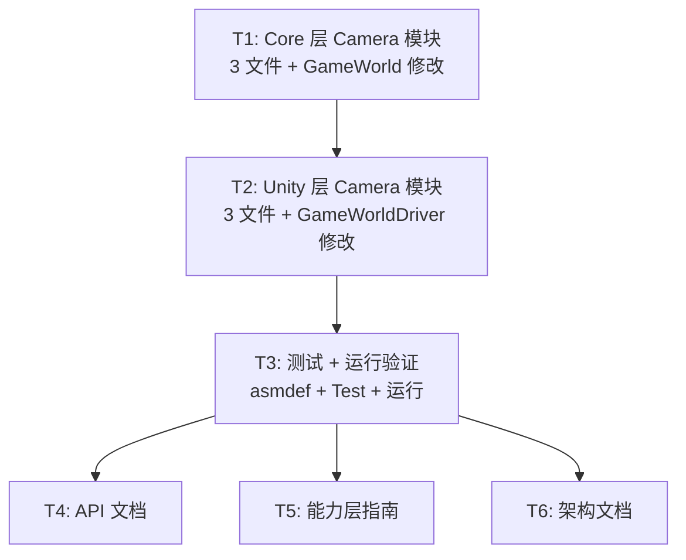

# 计划：C17 — 摄像机管理系统

## 概述

**目标**：从零构建 C17 摄像机管理系统（Camera System），实现架构文档中规划的 Core 层接口和 Unity 层 Cinemachine 集成。

**非目标**：
- ❌ 不实现 Editor 层的 CameraEditorWindow（留待后续）
- ❌ 不自行实现摄像机行为（Body/Aim/Noise/Blend），全量依赖 Cinemachine
- ❌ 不实现 ITickable（Cinemachine 自管理生命周期）

## 上下文分析

### 代码库成熟度

**纪律型（Disciplined）** — 框架具有清晰的架构模式、完整的测试覆盖（681/684 通过）、统一的命名空间和目录结构约定。新模块应严格遵循现有模式。

### 关键发现

| 发现 | 说明 |
|------|------|
| **模式参考** | C14 Input（事件驱动，sealed class, IDisposable, 无 ITickable）和 C16 Physics（完整数据模型族 + 接口 + Unity 实现）提供最佳参考 |
| **Cinemachine 2.10.7** | 已通过 package.json 声明为强制依赖，HN.Framework.Unity.asmdef 已引用 Unity.Cinemachine |
| **无现有代码** | Core/Capability/Camera/ 和 Unity/Capability/Camera/ 目录完全不存在，为纯 Greenfield 开发 |
| **GameWorld 集成** | 需在 GameWorld.cs 新增 CameraManager 属性，在 GameWorldDriver.cs 新增创建和注入代码 |
| **CameraManager 定位** | 作为游戏代码到 Cinemachine 的控制桥接，不重复实现摄像机逻辑 |

### 架构约束

1. **Core 层零 Unity 依赖**：ICameraManager 接口及 CameraPreset/CameraShakeProfile 数据模型不能引用任何 UnityEngine 或 Cinemachine 类型
2. **CameraManager 不实现 ITickable**：Cinemachine Brain 自行管理生命周期
3. **命名空间**：Core → HN.Framework.Core.Capability.Camera，Unity → HN.Framework.Unity.Capability.Camera
4. **公共 API 必须 XML 文档注释**

---

## 任务分解

### Wave 1 — Core 层（单 Sisyphus-Junior 会话，通过 MCP 创建全部 Core 层文件）

> **MCP 约束**：所有脚本创建/修改必须通过 Unity MCP 操作。同一 Unity 实例同一时间只允许一个任务。因此同一 asmdef 内的所有文件创建合并到单个 Sisyphus-Junior 会话中顺序执行。

| ID | 任务 | 描述 | 委派建议 | 验收标准 |
|----|------|------|----------|----------|
| T1 | Core 层 Camera 模块 | 1) 创建 CameraPreset.cs（数据模型：FOV/nearClip/farClip/priority/blendTime，实现 IReference）+ 创建 CameraShakeProfile.cs（振幅/频率/时长/衰减类型枚举，实现 IReference）；2) 创建 ICameraManager.cs（接口：RegisterPreset/SetActiveCamera/GetActiveCamera/BlendToCamera/Shake/StopShake/TryGetPreset/RemovePreset）；3) 修改 GameWorld.cs 添加 `ICameraManager? CameraManager` 属性。全部通过 MCP create_script 和 apply_text_edits 操作。 | Sisyphus-Junior | 编译通过，所有公共 API 有 XML 文档注释 |

### Wave 2 — Unity 层（单 Sisyphus-Junior 会话，依赖 Wave 1 编译完成）

| ID | 任务 | 描述 | 委派建议 | 验收标准 |
|----|------|------|----------|----------|
| T2 | Unity 层 Camera 模块 | 1) 创建 CameraHandle.cs（包装 CinemachineVirtualCamera：SetFollow/SetLookAt/ApplyPreset）；2) 创建 CameraShake.cs（CinemachineBasicMultiChannelPerlin 噪声控制：Start/Stop/UpdateProfile）；3) 创建 CameraManager.cs（sealed class 实现 ICameraManager + IDisposable，持有 CinemachineBrain + Dictionary<string,CameraHandle>）；4) 修改 GameWorldDriver.cs（Awake 中 new CameraManager + OnDestroy 中 Dispose）。使用 MCP batch_execute 批量创建脚本。 | Sisyphus-Junior | 编译通过，完整 API 实现，遵循已有注入模式 |

### Wave 3 — 测试（单 Sisyphus-Junior 会话，依赖 Wave 2）

| ID | 任务 | 描述 | 委派建议 | 验收标准 |
|----|------|------|----------|----------|
| T3 | 测试 + 运行验证 | 1) 修改 Test asmdef 添加 Unity.Cinemachine 引用；2) 创建 CameraManagerTests.cs（测试预设注册/查找/移除、活跃摄像机切换、Brain=null 降级行为）；3) 通过 Unity MCP 刷新编译；4) 运行 HN.Framework.Unity.Tests + HN.Framework.Core.Tests 两个程序集，确认无回归 | Sisyphus-Junior | 所有框架测试通过（含新增 CameraManagerTests） |

### Wave 4 — 文档（可并行，纯文件编辑，无 MCP 依赖）

| ID | 任务 | 描述 | 委派建议 | 验收标准 |
|----|------|------|----------|----------|
| T4 | 更新 API 文档 | 在 docs-site~/docs/api/index.md 的 Core/Capability 和 Unity/Capability 部分添加 C17 模块条目 | Sisyphus-Junior | 文档与代码一致 |
| T5 | 更新能力层指南 | 在 docs-site~/docs/guide/capability.md 添加 ICameraManager 行到服务接口表 | Sisyphus-Junior | 文档包含 C17 条目 |
| T6 | 更新架构文档 | 在 docs-site~/docs/dev/architecture.md 和 架构~/最终架构.md 中标记 C17 状态为 ✅ | Sisyphus-Junior | 状态矩阵中 C17 更新 |

---

## 依赖图



## Wave 分组

```
Wave 1: [T1]                       ← Core 层，单 MCP 会话串行
Wave 2: [T2]                       ← Unity 层，依赖 T1 编译完成
Wave 3: [T3]                       ← 测试 + 验证，依赖 T2
Wave 4: [T4, T5, T6]               ← 纯文档，完全并行
```

> **MCP 串行化说明**：T1/T2/T3 各自在单个 Sisyphus-Junior 会话中通过 MCP 操作，会话内可顺序创建多个脚本文件（使用 batch_execute 批量操作）。Wave 间严格顺序执行，每个 Wave 完成编译验证后才进入下一个 Wave。

---

## 风险与缓解

| 风险 | 可能性 | 影响 | 缓解策略 |
|------|--------|------|----------|
| CinemachineBrain 在 EditMode 测试中不可用 | 高 | T3 测试中涉及 Brain 的测试可能失败 | CameraManager 允许 brain 为 null，降级为 no-op；测试覆盖无 brain 场景 |
| FindObjectOfType<CinemachineBrain>() 在 Awake 时返回 null | 中 | 运行时空引用 | Awake 中使用 null 条件判断，CameraManager 允许后续通过属性设置 brain |
| CameraShake 依赖 CinemachineBasicMultiChannelPerlin 的版本 API 变化 | 低 | 编译时错误 | 使用 GetCinemachineComponent<T>() 泛型方法，是 Cinemachine 2.x 稳定 API |
| asmdef 中缺少 Cinemachine 引用导致编译失败 | 低 | T3 测试编译失败 | 在 T3 的第一步修改 asmdef 显式添加 Unity.Cinemachine 引用 |

---

## 设计决策（已确认）

1. **CameraShakeProfile 衰减曲线**：使用纯 C# 枚举 CameraShakeDecayType（Linear/Exponential/EaseOut/EaseIn/EaseInOut），不依赖 AnimationCurve ✅
2. **CameraManager 构造函数**：接受 CinemachineBrain? brain = null，允许 null（EditMode 兼容）✅
3. **VCam 创建策略**：CameraHandle 仅包装已存在的 VCam，不自建。RegisterPreset 仅存储预设数据 ✅
4. **测试 asmdef**：在测试 asmdef 中添加 Unity.Cinemachine 引用 ✅
5. **文档更新范围**：同步更新 架构~/最终架构.md 中 C17 状态 ✅
