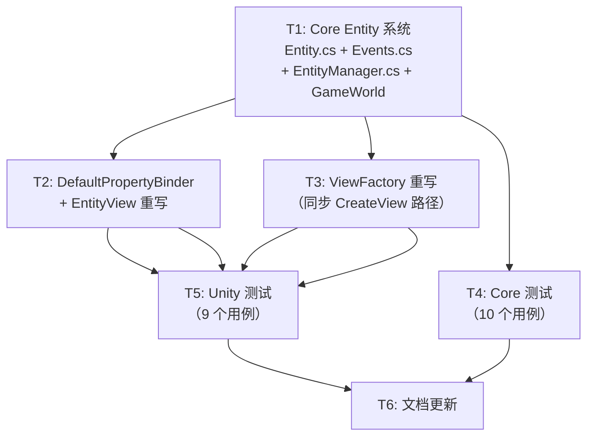

# 计划：L3/V2 — Entity 系统 + ViewFactory

> 生成日期：2026-07-13 · 修订 v2（Momus 审核修正）
> 基于架构文档 `架构~/最终架构.md` 和现有代码库状态编写

## 概述

**目标**：从零实现 Core 层 L3 Entity 系统（Entity 纯数据实体 + EntityManager 生命周期管理），完整实现 Unity 层 V2 视图基础设施（EntityView + ViewFactory + DefaultPropertyBinder），将 🚧 Stub 升级为 ✅ 可用模块。

**非目标**：
- 不涉及网络同步（C6 未来集成）
- 不涉及战斗属性/背包等上层系统（L7/L9 未来集成）
- 不涉及 ViewFactory 的异步加载（`IAssetManager` 当前 API 无返回值，留待未来扩展）
- 不涉及 EntityView 的具体 UI 绑定实现（由项目 Scripts 仓库继承）

## 上下文分析

### 代码库成熟度
**过渡型（Transitional）** — 核心基础设施（MVC/HFSM/EventBus/ReferencePool）已完整实现且测试覆盖良好，但部分模块仍为 Stub 状态。

### 关键发现

1. **Core 层零 Unity 依赖**：`HN.Framework.Core` 设置 `noEngineReferences: true`。
2. **可复用基础设施齐全**：`IReference`、`EventBus`、`ReadOnlyModel<T>`、`PropertyBinder(abstract)`、`ControllerManager`（注册/生命周期模式参考）。
3. **PropertyBinder 为抽象类**：不可直接 `new`。需创建 `DefaultPropertyBinder` 具体实现。
4. **IAssetManager.LoadAsset(string) 无返回值**：无法用于 ViewFactory 加载预制体。ViewFactory 采用调用方传入已加载 `GameObject` 的设计。
5. **EntityView 当前为 abstract**：需改为 concrete class（非抽象），子类通过重写虚方法扩展。
6. **所有 .cs 文件创建/修改必须通过 Unity MCP**（项目根目录映射到 Unity 工程 Assets/ 下）。

### 设计决策（已确认）

| 决策点 | 选择 | 方案 |
|--------|:----:|------|
| Entity 数据内容 | ✅ 方案 A | `EntityId`(uint) + `EntityDefId`(int) + `IReference` |
| ViewFactory 预制体加载 | ✅ 方案 A（适配） | 同步 `CreateView(prefab, ...)`，调用方负责加载预制体 |
| EntityManager Unity 桥接 | ✅ 方案 A | EventBus 发布 `EntitySpawnedEvent` / `EntityDespawnedEvent` |

---

## Momus 审核修正（v2）

| # | 原始问题 | 修正方案 |
|---|---------|---------|
| 1 | `PropertyBinder` 抽象类不可实例化 | 新增 `DefaultPropertyBinder` 具体实现，并入 T2 |
| 2 | `IAssetManager` 无返回 GameObject 的 API | ViewFactory 改为纯同步 `CreateView(GameObject prefab, ...)`，调用方负责加载；异步标记 TODO |
| 3 | `EntityView` abstract 导致 `AddComponent` 失败 | T2 中移除 `abstract`，改为 concrete + virtual 方法 |

---

## 任务分解

### Wave 1 — Core 层代码创建（MCP 操作，batch_execute 批量）

| ID | 任务 | 描述 | 委派建议 | 验收标准 |
|----|------|------|----------|----------|
| T1 | 创建 Core Entity 系统 | 创建 3 个新文件 + 修改 1 个文件（通过 MCP batch_execute）：<br>① `Entity.cs` — `[MemoryPackable]` + `IReference`<br>② `EntityEvents.cs` — Spawn/Despawn 事件结构体<br>③ `EntityManager.cs` — Spawn/Despawn/GetEntity + EventBus<br>④ 修改 `GameWorld.cs` — 添加 `EntityManager` 属性 | Sisyphus-Junior | 编译器无错误；GameWorld.EntityManager 可访问；Entity 可 MemoryPack 序列化 |

**T1 详细规格：**

**Entity.cs** (`Runtime/HN.Framework.Core/Level/Logic/Entity/Entity.cs`)：
- 命名空间：`HN.Framework.Core.Level.Logic.Entity`
- `[MemoryPackable] public partial class Entity : IReference`
- `[MemoryPackOrder(0)] public uint EntityId { get; private set; }`
- `[MemoryPackOrder(1)] public int EntityDefId { get; private set; }`
- `public void Clear()` — 重置 Id=0, DefId=0
- `internal void Initialize(uint id, int defId)` — 供 EntityManager 调用
- 包含完整 XML 文档注释

**EntityEvents.cs** (`Runtime/HN.Framework.Core/Level/Logic/Entity/EntityEvents.cs`)：
- `public readonly struct EntitySpawnedEvent`：uint EntityId, int EntityDefId
- `public readonly struct EntityDespawnedEvent`：uint EntityId

**EntityManager.cs** (`Runtime/HN.Framework.Core/Level/Logic/Entity/EntityManager.cs`)：
- 构造函数注入 `EventBus` 实例
- `Spawn(int entityDefId) → Entity`：自增 ID，发布 `EntitySpawnedEvent`
- `Despawn(uint entityId)`：Remove + ReferencePool.Release + 发布 `EntityDespawnedEvent`
- `GetEntity(uint entityId) → Entity?`（null if not found）
- `int EntityCount { get; }`
- 内部 `Dictionary<uint, Entity>` + `uint _nextEntityId`
- 不在 GameWorld.Tick 中驱动（纯事件驱动，不参与帧循环）

**GameWorld.cs 修改**：
- 添加 `using HN.Framework.Core.Level.Logic.Entity;`
- 添加属性：`public EntityManager EntityManager { get; }`
- 构造函数末尾添加：`EntityManager = new EntityManager(EventBus);`

---

### Wave 2 — Unity 层 View 代码（MCP 操作，同一实例串行）

| ID | 任务 | 描述 | 委派建议 | 验收标准 |
|----|------|------|----------|----------|
| T2 | 创建 DefaultPropertyBinder + 重写 EntityView | ① 新建 `DefaultPropertyBinder.cs` — PropertyBinder 的默认实现（Dictionary 存储绑定，UnbindAll 批量解绑）<br>② 重写 `EntityView.cs` — 移除 `abstract`，添加 OnSpawned/OnDespawned 生命周期，内建 DefaultPropertyBinder | Sisyphus-Junior | 编译器无错误；EntityView 可 AddComponent；OnSpawned/OnDespawned 可被子类重写 |
| T3 | 重写 ViewFactory.cs | 同步 `CreateView(GameObject prefab, Vector3, Quaternion, Transform)` + `ReleaseView(EntityView)` + 预制体缓存 + EntityDefId 映射表注册。异步接口标记 TODO。 | Sisyphus-Junior | 编译器无错误；CreateView 产生有效 EntityView；ReleaseView 销毁 GameObject |

**T2 详细规格：**

**DefaultPropertyBinder.cs** (`Runtime/HN.Framework.Unity/Level/View/Binding/DefaultPropertyBinder.cs`)：
- `public sealed class DefaultPropertyBinder : PropertyBinder`
- 内部 `Dictionary<object, Delegate>` 存储绑定
- `Bind<T>(IReadOnlyModel<T> source, Action<T> onValueChanged)`：
  - 订阅 `source.OnValueChanged`，在回调中调用 `onValueChanged`
  - 立即调用一次 `onValueChanged(source.Value)` 初始化
  - 将 source 作为 key 存入字典
- `UnbindAll()`：
  - 遍历字典，对每个 IReadOnlyModel<T> 取消订阅
  - 清空字典

**EntityView.cs** (重写，非 abstract)：
- `public class EntityView : MonoBehaviour`（**移除 abstract**）
- `public uint EntityId { get; private set; }`
- `public int EntityDefId { get; private set; }`
- `protected PropertyBinder Binder { get; private set; }`
- `protected virtual void OnSpawned() { }`
- `protected virtual void OnDespawned() { }`
- `internal void Initialize(uint entityId, int entityDefId)`：
  - 设置 Id → 创建 `new DefaultPropertyBinder()` → 调用 `OnSpawned()`
- `internal void Deinitialize()`：
  - 调用 `OnDespawned()` → `Binder.UnbindAll()` → 重置 Id
- 保持原 `BindData` 方法兼容（调用 Initialize）

**T3 详细规格 — ViewFactory.cs**：
- 构造函数注入 `IAssetManager`（用于引用计数管理）
- `Dictionary<int, string> _prefabMappings` — EntityDefId → Prefab Address 映射
- `Dictionary<string, GameObject> _prefabCache` — 已加载的预制体缓存
- `void RegisterPrefabMapping(int entityDefId, string prefabAddress)`
- `EntityView CreateView(GameObject prefab, Vector3 position, Quaternion rotation, int entityDefId, Transform parent = null)`：
  - Instantiate prefab → GetComponent\<EntityView\>（prefab 上必须已挂载 EntityView 子类）→ Initialize(entityDefId) → 设置 Transform → 返回
- `void ReleaseView(EntityView view)`：
  - view.Deinitialize() → Destroy(view.gameObject)
- `async UniTask<EntityView> CreateViewAsync(...)` → **标记 TODO**（IAssetManager 暂不支持返回 GameObject，留待未来扩展）

---

### Wave 3 — 测试编写与验证（MCP 操作，同一实例串行）

| ID | 任务 | 描述 | 委派建议 | 验收标准 |
|----|------|------|----------|----------|
| T4 | Core 层 Entity 测试 | ① 创建 `EntityTests.cs` + `EntityManagerTests.cs`（MCP create_script）<br>② refresh_unity 编译<br>③ run_tests（EditMode, HN.Framework.Core.Tests assembly） | Sisyphus-Junior | 全部 Core 测试通过 |
| T5 | Unity 层 EntityView 测试 | ① 创建 `EntityViewTests.cs` + `ViewFactoryTests.cs`（MCP create_script）<br>② refresh_unity 编译<br>③ run_tests（EditMode, HN.Framework.Unity.Tests assembly） | Sisyphus-Junior | 全部 Unity 测试通过 |

**T4 测试清单：**

`EntityTests.cs`（命名空间 `HN.Framework.Core.Tests.Level.Logic.Entity`）：
- `Entity_AfterSpawn_HasCorrectIdAndDefId` — EntityManager.Spawn 返回的 Entity 具有正确递增 Id
- `Entity_Clear_ResetsFieldsToDefault` — Clear() 后 Id=0, DefId=0
- `Entity_MemoryPack_Roundtrip_FieldsPreserved` — 序列化→反序列化，Id/DefId 一致
- `Entity_IsReferencePoolCompatible` — ReferencePool.Acquire/Release 正常循环

`EntityManagerTests.cs`（命名空间同上）：
- `Spawn_ReturnsEntityWithUniqueIncrementingId`
- `Spawn_MultipleEntities_AllHaveDifferentIds`
- `Despawn_ExistingEntity_EntityCountDecreases`
- `Despawn_NonExistentEntity_DoesNotThrow`
- `GetEntity_ExistingId_ReturnsCorrectEntity`
- `GetEntity_NonExistentId_ReturnsNull`
- `EntityCount_MatchesSpawnMinusDespawn`
- `Spawn_PublishesEntitySpawnedEventViaEventBus`
- `Despawn_PublishesEntityDespawnedEventViaEventBus`

**T5 测试清单：**

`EntityViewTests.cs`（命名空间 `HN.Framework.Unity.Tests.Level.View`）：
- `Initialize_SetsEntityIdAndDefId`
- `Initialize_CallsOnSpawned` — 子类重写验证
- `Deinitialize_CallsOnDespawned`
- `Deinitialize_ResetsEntityIdToZero`
- `Deinitialize_CallsUnbindAll_OnBinder`

`ViewFactoryTests.cs`（命名空间同上）：
- `CreateView_FromPrefab_CreatesEntityViewComponent`
- `CreateView_SetsCorrectWorldTransform`
- `CreateView_EntityViewHasValidEntityId`
- `ReleaseView_DestroysGameObject`

---

### Wave 4 — 文档更新（文件系统操作，bash 写文件）

| ID | 任务 | 描述 | 委派建议 | 验收标准 |
|----|------|------|----------|----------|
| T6 | 更新 docs-site 文档 | 更新 5 个文档：<br>① `guide/entity.md` — 🚧 Stub → 完整使用指南<br>② `guide/view-factory.md` — 🚧 Stub → 完整使用指南<br>③ `api/index.md` — 添加 Entity/EntityManager/DefaultPropertyBinder<br>④ `dev/architecture.md` — L3/V2 状态 🚧→✅<br>⑤ `架构~/开发优先级.md` — 状态更新 | Sisyphus-Junior | 文档内容准确反映实现 |

---

## 依赖图



**执行顺序（MCP 互斥约束）**：
```
Wave 1: T1（MCP batch_execute: 3 个 create_script + 1 个 edit → refresh_unity 编译验证）
    ↓
Wave 2: T2（MCP: create_script + create_script/edit）→ T3（MCP: create_script/edit）
    ↓
Wave 3: T4（MCP: 2 个 create_script + refresh + run_tests）→ T5（MCP: 2 个 create_script + refresh + run_tests）
    ↓
Wave 4: T6（bash 写文件）
```

---

## 风险与缓解

| 风险 | 可能性 | 影响 | 缓解策略 |
|------|:------:|------|----------|
| MemoryPack 序列化 Entity 编译失败 | 低 | 阻塞 T1 | Entity 使用 `[MemoryPackable]` partial class，字段 `[MemoryPackOrder]`，遵循现有 `AssetRef<T>` 模式 |
| DefaultPropertyBinder 中 Delegate 类型转换异常 | 低 | T2 测试失败 | 使用 `Dictionary<object, Action>` 存储无类型回调，Bind 中通过闭包捕获类型信息 |
| EntityView prefab 未挂载 EntityView 组件 | 中 | T3/T5 运行时异常 | ViewFactory.CreateView 使用 `GetComponent<EntityView>()`（非 AddComponent），prefab 上需事先挂载；文档中说明此约束 |
| 测试中 EntityView 需要 MonoBehaviour 环境 | 低 | T5 编译/运行 | 使用 `new GameObject().AddComponent<TestEntityView>()` 标准模式，参考现有 UIToastTests |
| MCP batch_execute 超时 | 低 | T1 延迟 | 拆分为 2 个 batch 调用 |

---

## 文件清单

### 新建文件

| 文件 | 路径 | 层 |
|------|------|:--:|
| `Entity.cs` | `Runtime/HN.Framework.Core/Level/Logic/Entity/` | Core |
| `EntityEvents.cs` | `Runtime/HN.Framework.Core/Level/Logic/Entity/` | Core |
| `EntityManager.cs` | `Runtime/HN.Framework.Core/Level/Logic/Entity/` | Core |
| `DefaultPropertyBinder.cs` | `Runtime/HN.Framework.Unity/Level/View/Binding/` | Unity |
| `EntityTests.cs` | `Tests/HN.Framework.Core.Tests/Level/Logic/Entity/` | Test |
| `EntityManagerTests.cs` | `Tests/HN.Framework.Core.Tests/Level/Logic/Entity/` | Test |
| `EntityViewTests.cs` | `Tests/HN.Framework.Unity.Tests/Level/View/` | Test |
| `ViewFactoryTests.cs` | `Tests/HN.Framework.Unity.Tests/Level/View/` | Test |

### 修改文件

| 文件 | 变更 |
|------|------|
| `GameWorld.cs` | 添加 EntityManager 属性 + 构造初始化 |
| `EntityView.cs` | abstract → concrete + 完整生命周期 |
| `ViewFactory.cs` | 空骨架 → 同步 CreateView/ReleaseView + 映射表 |
| `docs-site~/docs/guide/entity.md` | 🚧 Stub → 完整指南 |
| `docs-site~/docs/guide/view-factory.md` | 🚧 Stub → 完整指南 |
| `docs-site~/docs/api/index.md` | 新增 API 索引条目 |
| `docs-site~/docs/dev/architecture.md` | L3/V2 状态更新 |
| `架构~/开发优先级.md` | L3/V2 状态更新 |

---

> **下一步**：用户批准后，使用 `/start-work` 启动 Atlas 执行本计划。
