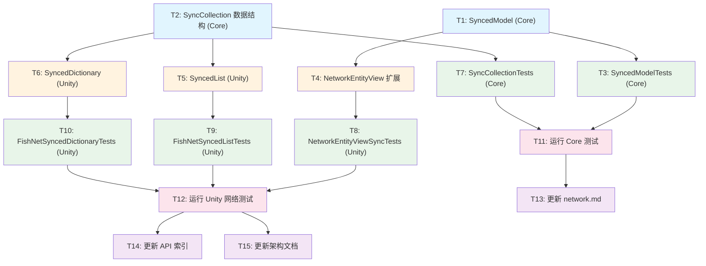

# 计划：C6.1 状态同步机制

## 概述

**目标**：打通"服务端 Core Model → FishNet SyncVar/SyncList → 客户端 IReadOnlyModel → View PropertyBinder"的完整数据同步链路。

**非目标**：帧同步（lockstep）、客户端预测与校验（C6.2）、实体权限与生命周期（C6.3）、NetworkTransform/NetworkAnimator 封装。

## 上下文分析

### 代码库成熟度：纪律型（Disciplined）

Core 层和 Unity 层均有清晰的命名空间分层、完整的 XML 文档注释、规范的测试覆盖。网络模块 Phase 1（FishNet 集成）已完成，INetworkManager、MessageBase、FishNetNetworkManager、NetworkEntityView 等基础设施已就绪。

### 关键发现

1. **FishNet v4 API 变更**：FishNet v4.7.2 中 `[SyncVar]` 属性已废弃（`[Obsolete]`），新 API 使用 `SyncVar<T>` 泛型类。`SyncVar<T>` 提供 `.Value` 属性（读/写）和 `.OnChange` 事件（`delegate void OnChanged(T prev, T next, bool asServer)`）。

2. **FishNet 已提供 IReadOnly 接口**：`SyncList<T>` 实现 `IReadOnlyList<T>`，`SyncDictionary<TKey,TValue>` 实现 `IReadOnlyDictionary<TKey,TValue>`。框架层面无需重新封装为只读接口。

3. **架构一致性问题**：架构文档 `架构~/最终架构.md` 第 833 行描述使用 `[SyncVar]` 属性声明，需同步更新为 `SyncVar<T>` 新模式。

4. **Safe-for-serialization 约束**：`SyncVar<T>`、`SyncList<T>`、`SyncDictionary<T>` 需要 `[SerializeField]` 标记才能被 FishNet 代码生成器发现（Unity 序列化规则）。

5. **测试环境约束**：EditMode 测试中创建带 NetworkObject 的 GameObject 需要特殊处理。FishNet 的 `SyncVar<T>` 需要 `IsInitialized` 状态才能正常工作，EditMode 测试需要通过反射设置或使用 mock。

## 任务分解

### Wave 1（无依赖，可并行）

| ID | 任务 | 描述 | 委派建议 | 验收标准 |
|----|------|------|----------|----------|
| T1 | 创建 Core 层 `SyncedModel<T>` | 在 `Runtime/HN.Framework.Core/Capability/Network/` 下创建 `SyncedModel.cs`。一个可写的、线程安全的数据容器，实现 `IReadOnlyModel<T>` 接口。支持服务端写入、客户端读取、dirty tracking、值变更事件。 | Sisyphus-junior | • 实现 `IReadOnlyModel<T>` 接口 • `SetValue(T)` 方法仅在新值不同时触发 OnValueChanged • `bool IsDirty` 属性跟踪变更状态 • `ClearDirty()` 重置脏标记 • 完整的 XML 文档注释 • 命名空间 `HN.Framework.Core.Capability.Network` |
| T2 | 创建 Core 层集合变更数据结构 | 在 `Runtime/HN.Framework.Core/Capability/Network/` 下创建 `SyncCollection.cs`。定义 `SyncCollectionOperation` 枚举（Add/Remove/Insert/Set/Clear）和 `SyncCollectionChange<T>` 只读结构体。 | Sisyphus-junior | • 枚举值映射 FishNet 的 `SyncListOperation` • `SyncCollectionChange<T>` 含 Operation、Index、Item、OldItem 字段 • 完整的 XML 文档注释 • 纯数据，不依赖 Unity |
| T3 | 创建 Core 层 `SyncedModelTests` | 在 `Tests/HN.Framework.Core.Tests/Capability/Network/` 下创建 `SyncedModelTests.cs`。测试 SyncedModel 的读/写、变更通知、dirty tracking。 | Sisyphus-junior | • 测试 SetValue 触发 OnValueChanged • 测试相同值不触发事件 • 测试 dirty tracking 正确性 • 测试 Clear/Reset 行为 • 测试多类型（int、float、string、自定义 struct） • 遵循项目测试规范 |

### Wave 2（依赖 Wave 1）

| ID | 任务 | 描述 | 委派建议 | 验收标准 |
|----|------|------|----------|----------|
| T4 | 扩展 `NetworkEntityView` 同步基础设施 | 修改 `Runtime/HN.Framework.Unity/Capability/Network/NetworkEntityView.cs`。添加 `RegisterSyncedModel<T>`、`UnregisterSyncedModel<T>`、`ApplySyncValue<T>` 方法。提供 SyncVar 变更回调到 IReadOnlyModel 的桥接辅助。处理 Host 模式（直接写值，避免网络往返回调延迟）。 | Sisyphus-junior | • `RegisterSyncedModel<T>` 注册 SyncedModel 用于生命周期追踪 • `UnregisterSyncedModel<T>` 注销并清理 • `ApplySyncValue<T>(SyncedModel<T>, T)` 辅助方法（Host 下直接 SetValue，非 Host 仅非 Server 时更新） • 重写 `OnDespawned` 自动注销所有已注册模型 • 保持向后兼容 |
| T5 | 创建 `SyncedList<T>` Unity 包装器 | 在 `Runtime/HN.Framework.Unity/Capability/Network/` 下创建 `FishNetSyncedList.cs`。继承 FishNet `SyncList<T>`，添加框架友好的 `OnCollectionChanged` 事件，桥接 FishNet 的 `SyncListChanged` 到框架的 `SyncCollectionChange<T>`。 | Sisyphus-junior | • 继承 `SyncList<T>` • `event Action<SyncCollectionChange<T>> OnCollectionChanged` • 正确映射 5 种操作类型 • 通过 `[SyncObject]` 或 `new` 在 NetworkBehaviour 中声明使用 • 完整的 XML 文档注释 |
| T6 | 创建 `SyncedDictionary<TKey,TValue>` Unity 包装器 | 在 `Runtime/HN.Framework.Unity/Capability/Network/` 下创建 `FishNetSyncedDictionary.cs`。继承 FishNet `SyncDictionary<TKey,TValue>`，添加框架友好的 `OnCollectionChanged` 事件。 | Sisyphus-junior | • 继承 `SyncDictionary<TKey,TValue>` • `event Action<SyncDictChange<TKey,TValue>> OnCollectionChanged` • 正确映射 Add/Set/Remove/Clear 操作 • 完整的 XML 文档注释 |
| T7 | 创建 `SyncCollectionTests` (Core) | 在 `Tests/HN.Framework.Core.Tests/Capability/Network/` 下创建 `SyncCollectionTests.cs`。测试 `SyncCollectionChange<T>` 结构体的创建和字段正确性。 | Sisyphus-junior | • 测试所有 5 种操作类型 • 测试结构体字段值正确性 • 遵循项目测试规范 |

### Wave 3（依赖 Wave 2）

| ID | 任务 | 描述 | 委派建议 | 验收标准 |
|----|------|------|----------|----------|
| T8 | 创建 `NetworkEntityViewSyncTests` | 在 `Tests/HN.Framework.Unity.Tests/Capability/Network/` 下创建 `NetworkEntityViewSyncTests.cs`。测试 NetworkEntityView 的同步模型注册/注销、ApplySyncValue 行为。 | Sisyphus-junior | • 测试注册/注销生命周期 • 测试 ApplySyncValue Host 模式 • 测试 ApplySyncValue Client 模式 • 测试 OnDespawned 自动清理 • 遵循项目测试规范 |
| T9 | 创建 `FishNetSyncedListTests` | 在 `Tests/HN.Framework.Unity.Tests/Capability/Network/` 下创建 `FishNetSyncedListTests.cs`。Test Fixture 创建带 NetworkObject 的 GameObject，挂载测试组件，验证 SyncedList 包装器的事件映射。 | Sisyphus-junior | • 使用 `[RequireComponent(typeof(NetworkObject))]` 测试组件 • 测试 Add/Remove/Insert/Set/Clear 操作的 OnCollectionChanged 事件 • 遵循项目测试规范（HideFlags.HideAndDontSave 等） |
| T10 | 创建 `FishNetSyncedDictionaryTests` | 在 `Tests/HN.Framework.Unity.Tests/Capability/Network/` 下创建 `FishNetSyncedDictionaryTests.cs`。验证 SyncedDictionary 包装器的事件映射。 | Sisyphus-junior | • 测试 Add/Set/Remove/Clear 操作的 OnCollectionChanged 事件 • 验证键值正确传递 • 遵循项目测试规范 |
| T11 | 运行 Core 层测试并修复 | 通过 Unity MCP 运行 `HN.Framework.Core.Tests` 程序集的所有 EditMode 测试，确保新测试通过且无回归。 | Sisyphus-junior | • 所有 Core 层测试通过 • 无回归 |
| T12 | 运行 Unity 层网络测试并修复 | 通过 Unity MCP 运行 `HN.Framework.Unity.Tests` 程序集中 `Capability/Network/` 目录下的 EditMode 测试，修复失败用例。 | Sisyphus-junior | • 所有网络模块测试通过 • 无回归 |

### Wave 4（依赖 Wave 3，全部测试通过后）

| ID | 任务 | 描述 | 委派建议 | 验收标准 |
|----|------|------|----------|----------|
| T13 | 更新网络模块使用指南 | 更新 `docs-site~/docs/guide/network.md`。在 Phase 2 章节补充 C6.1 状态同步的使用指南，包含 SyncedModel 绑定模式、SyncedList/SyncedDictionary 用法、Host 模式注意事项和完整代码示例。 | Sisyphus-junior | • 补充 SyncVar<T> + SyncedModel<T> 绑定模式示例 • 补充 SyncedList/SyncedDictionary 用法 • 说明 Host 模式特殊处理 • 修正文档中 `[SyncVar]` 旧 API 引用 |
| T14 | 更新 API 索引文档 | 更新 `docs-site~/docs/api/index.md`，添加 SyncedModel、SyncedList、SyncedDictionary 等新公开类型的 API 条目。 | Sisyphus-junior | • 新增类型在索引中可检索 • 条目包含命名空间、文件路径、简要说明 |
| T15 | 更新架构文档 SyncVar API 描述 | 更新 `架构~/最终架构.md`，将 C6.1 章节中的 `[SyncVar]` 属性声明修正为 FishNet v4 的 `SyncVar<T>` 模式，并标注 C6.1 状态为已完成。 | Sisyphus-junior | • 修正第 833 行附近的 API 描述 • 更新 C6.1 状态标记 • 保持架构文档结构一致 |

## 依赖图

**图例**：🟦 Core 代码 | 🟧 Unity 代码 | 🟩 测试代码 | 🩷 验证 | 🟪 文档

### 并行说明

- **Wave 1**：T1、T2 完全独立，可并行执行
- **Wave 2**：T4、T5、T6 互不依赖，可并行执行（均依赖 Wave 1 产物）
- **Wave 3**：T3 依赖 T1，T7 依赖 T2；但 T8、T9、T10 全部依赖 Wave 2，可并行执行
- **Wave 4**：T13、T14、T15 全部依赖 T11+T12 通过，可并行执行

### 软件实例互斥

- **T11** 和 **T12** 都通过 Unity MCP 运行测试。由于这是同一 Unity 实例的只读操作（run_tests），可以先后串行执行但不可并行。
- 所有涉及代码创建的 T1-T10 通过 `create_script` / `apply_text_edits` / `script_apply_edits` 工具操作 Unity，均需要同一 Unity 实例。但这些是文件级别的独立操作，可以并行提交 batch。

## 风险与缓解

| 风险 | 可能性 | 影响 | 缓解策略 |
|------|--------|------|----------|
| FishNet `SyncVar<T>` 在 EditMode 测试中无法正常初始化（需要 NetworkObject 初始化完成） | 中 | 高 — 阻碍 Unity 层测试 | 使用 `[RequireComponent(typeof(NetworkObject))]` 创建测试组件，通过反射设置 `IsInitialized` 内部状态，或使用 mock 验证事件回调逻辑 |
| `SyncedModel<T>` 与 `ReadOnlyModel<T>` 的语义重叠 | 低 | 低 — API 混淆 | `SyncedModel<T>` 明确定义为双向可写模型，与 `ReadOnlyModel<T>` 区分；文档中说明各自使用场景 |
| Host 模式下 ApplySyncValue 逻辑错误 | 中 | 中 — Host 模式下数据不一致 | 专项测试覆盖 Host 模式路径；明确规则：Host 下 server 侧 .Value 写已触发 OnChange，ApplySyncValue 仅更新 client 侧 IReadOnlyModel |
| SyncedList/SyncedDictionary 包装器命名与 FishNet 内置类型混淆 | 低 | 低 — 用户分不清 | 命名为 `FishNetSyncedList<T>` / `FishNetSyncedDictionary<TKey,TValue>`，在 XML 文档中明确说明继承自 FishNet 的 SyncList/SyncDictionary |

## 任务委派总结

| 委派 | 任务数 | 任务 ID |
|------|:------:|---------|
| **Sisyphus-Junior** | 15 | T1-T15 |
| **Oracle** | 0 | — |
| **Librarian** | 0 | — |

全部 15 个任务均为代码编写和测试任务，委派给 Sisyphus-Junior 执行。

## 代码变更清单

### 新建文件（8 个）

| 文件 | 路径 | 层级 |
|------|------|:----:|
| SyncedModel.cs | `Runtime/HN.Framework.Core/Capability/Network/SyncedModel.cs` | Core |
| SyncCollection.cs | `Runtime/HN.Framework.Core/Capability/Network/SyncCollection.cs` | Core |
| FishNetSyncedList.cs | `Runtime/HN.Framework.Unity/Capability/Network/FishNetSyncedList.cs` | Unity |
| FishNetSyncedDictionary.cs | `Runtime/HN.Framework.Unity/Capability/Network/FishNetSyncedDictionary.cs` | Unity |
| SyncedModelTests.cs | `Tests/HN.Framework.Core.Tests/Capability/Network/SyncedModelTests.cs` | Test |
| SyncCollectionTests.cs | `Tests/HN.Framework.Core.Tests/Capability/Network/SyncCollectionTests.cs` | Test |
| NetworkEntityViewSyncTests.cs | `Tests/HN.Framework.Unity.Tests/Capability/Network/NetworkEntityViewSyncTests.cs` | Test |
| FishNetSyncedListTests.cs | `Tests/HN.Framework.Unity.Tests/Capability/Network/FishNetSyncedListTests.cs` | Test |
| FishNetSyncedDictionaryTests.cs | `Tests/HN.Framework.Unity.Tests/Capability/Network/FishNetSyncedDictionaryTests.cs` | Test |

### 修改文件（5 个）

| 文件 | 路径 | 变更内容 |
|------|------|----------|
| NetworkEntityView.cs | `Runtime/HN.Framework.Unity/Capability/Network/NetworkEntityView.cs` | 添加 RegisterSyncedModel/UnregisterSyncedModel/ApplySyncValue 方法 |
| network.md | `docs-site~/docs/guide/network.md` | 补充 C6.1 使用指南 |
| index.md (API) | `docs-site~/docs/api/index.md` | 添加新类型条目 |
| 最终架构.md | `架构~/最终架构.md` | 修正 SyncVar API 描述，更新 C6.1 状态 |
| 开发优先级.md | `架构~/开发优先级.md` | 更新 C6 状态描述 |
