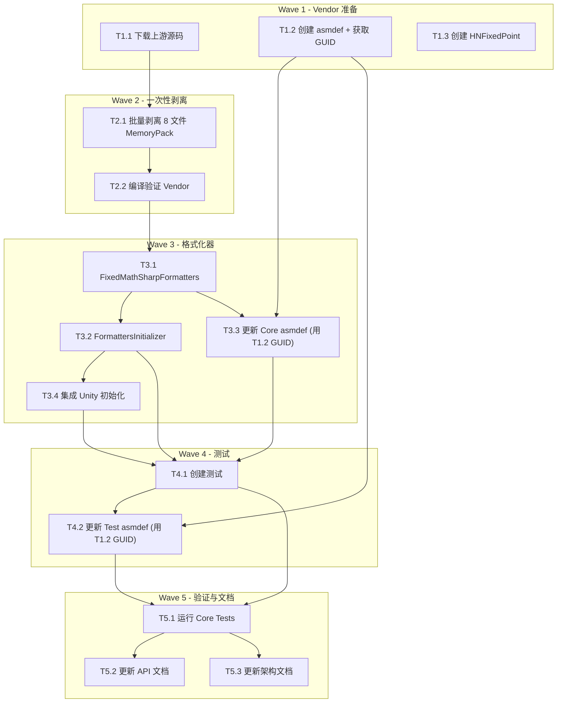

# 计划：D2.6 FixedMathSharp 开发

> 生成日期：2026-07-14
> 审核状态：✅ Momus 审核通过（已修复 2 个阻塞问题）
> 目标：将 FixedMathSharp（Lean 版）作为第三方定点数库 vendored 到框架 Core 层

---

## 概述

**目标**：将 FixedMathSharp（Lean 版）作为第三方定点数库（Q32.32）纳入框架 Core/Vendor 层，剥离原库的 MemoryPack 属性，创建框架层自定义 MemoryPack 格式化器，编写单元测试，更新文档。

**非目标**：不修改 FixedMathSharp 的数学逻辑，不涉及 Unity 层的定点数使用场景。

**架构定位**：D2 基础类库可选模块，仅 lockstep 帧同步场景需要。

---

## 上下文分析

### 代码库成熟度

**过渡型（Transitional）** — Core 层和 Unity 层已有成熟的序列化模式（`UnityFormatters` + `UnityFormattersInitializer`），Vendor 目录已有 MemoryPack vendored 先例。但 Core 层 Serialization 目录尚未有格式化器注册初始化器，需按架构文档补齐。

### 关键发现

| 发现 | 细节 |
|------|------|
| **Vendor 先例** | `Core/Vendor/MemoryPack/` 已有完整模式：独立 asmdef + `noEngineReferences: true` + `allowUnsafeCode: true` |
| **Formatter 模式** | `UnityFormatters.cs`（16 个 formatter）+ `UnityFormattersInitializer.cs`（`RegisterAll()`）已建立明确模式 |
| **Core asmdef** | 已通过 GUID `3c1b0d1c2470401da464c2f78e21cbbe` 引用 `HN.Framework.Core.Vendor.MemoryPack`，需新增 FixedMathSharp vendor 引用 |
| **Core Serialization 缺项** | 尚无 Core 层 `FormattersInitializer.cs`（架构文档指定了但未实现） |
| **HNFixedPoint** | 架构文档指定路径 `Driver/Common/Math/HNFixedPoint.cs`，当前不存在，需创建类型别名 |
| **上游源码** | FixedMathSharp 仓库约 50 个 .cs 文件，8 个含 MemoryPack 属性需剥离 |

### 决策记录

| 决策点 | 选择 | 理由 |
|--------|------|------|
| MemoryPack 剥离方式 | 机械删除（非条件编译），8 个文件一次性批量剥离 | 架构文档要求"机械剥离"；分批剥离会导致 mid-Wave 编译失败（未剥离文件仍在引用 MemoryPack） |
| HNFixedPoint 策略 | `using HNFixedPoint = FixedMathSharp.Fixed64;` 类型别名 | 保持 API 兼容性，零运行时开销 |
| Core FormattersInitializer | 创建独立的 `FormattersInitializer.cs`，被 Unity 层 `UnityFormattersInitializer` 调用 | 架构文档建议，保持分层初始化一致性 |
| asmdef GUID 获取 | T1.2 创建 asmdef 后，读取 `.meta` 文件中的 `guid` 字段供 T2.3 和 T3.2 使用 | GUID 由 Unity 自动生成，执行时动态读取 |

---

## 任务分解

### Wave 1 — Vendor 源码准备（无依赖，可并行）

| ID | 任务 | 描述 | 委派建议 | 验收标准 |
|----|------|------|----------|----------|
| T1.1 | 下载 FixedMathSharp 上游源码 | 从 `mrdav30/FixedMathSharp` 仓库 main 分支获取 `src/FixedMathSharp/` 目录全部文件（~50 个 .cs 文件），放置到 `Runtime/HN.Framework.Core/Vendor/FixedMathSharp/`，保持原始子目录结构 | Sisyphus-Junior | 文件完整，目录结构与上游一致 |
| T1.2 | 创建 Vendor asmdef | 通过 Unity MCP 在 `Core/Vendor/FixedMathSharp/` 创建 `HN.Framework.Core.Vendor.FixedMathSharp.asmdef`：`noEngineReferences: true`，`allowUnsafeCode: true`，`rootNamespace: "FixedMathSharp"`，无其他 references。**创建后立即读取 `.meta` 文件获取 GUID**，记录备后续步骤使用 | Sisyphus-Junior | asmdef 存在，`noEngineReferences: true`，GUID 已记录 |
| T1.3 | 创建 HNFixedPoint.cs 占位 | 在 `Runtime/HN.Framework.Core/Driver/Common/Math/` 创建 `HNFixedPoint.cs`，内容为 `using HNFixedPoint = FixedMathSharp.Fixed64;` | Sisyphus-Junior | 文件存在，命名空间 `HN.Framework.Core.Driver.Common.Math` |

### Wave 2 — MemoryPack 批量剥离（依赖 Wave 1 T1.1）

> ⚠️ 关键策略：由于 FixedMathSharp asmdef 不引用 MemoryPack，必须一次性剥离所有 8 个文件的 MemoryPack 引用，然后统一编译验证。分批剥离会导致 mid-Wave 编译失败。

| ID | 任务 | 描述 | 委派建议 | 验收标准 |
|----|------|------|----------|----------|
| T2.1 | 批量剥离 MemoryPack | 对以下 8 个文件，删除所有 `using MemoryPack;` 语句、`[MemoryPackable]`/`[MemoryPackInclude]`/`[MemoryPackOrder(N)]`/`[MemoryPackIgnore]` 属性、`partial` 关键字：
① `Numerics/Scalars/Fixed64.cs`
② `Numerics/Vectors/Vector2d.cs`
③ `Numerics/Vectors/Vector3d.cs`
④ `Numerics/Vectors/Vector4d.cs`
⑤ `Numerics/Rotations/FixedQuaternion.cs`
⑥ `Numerics/Matrices/Fixed4x4.cs`
⑦ `Geometry/Bounds/FixedBoundBox.cs`
⑧ `Geometry/Bounds/FixedBoundSphere.cs`
使用 Unity MCP `script_apply_edits` 定位并删除属性行和 using 行 | Sisyphus-Junior | 8 个文件均不再包含任何 MemoryPack 引用 |
| T2.2 | 编译验证 Vendor 程序集 | 通过 Unity MCP `refresh_unity(compile="request")` 触发编译，确认 `HN.Framework.Core.Vendor.FixedMathSharp` 程序集无错误 | Sisyphus-Junior | Unity Console 无编译错误 |

### Wave 3 — 格式化器实现（依赖 Wave 1 + Wave 2 全部完成）

| ID | 任务 | 描述 | 委派建议 | 验收标准 |
|----|------|------|----------|----------|
| T3.1 | 创建 FixedMathSharpFormatters.cs | 在 `Runtime/HN.Framework.Core/Capability/Serialization/` 创建，包含 8 个 `[Preserve] MemoryPackFormatter<T>`，遵循 `WriteUnmanaged`/`ReadUnmanaged` 模式。序列化策略见下方设计表。需使用 FixedMathSharp 的 public API（`RawValue`/`FromRaw`/`X/Y/Z/W` 属性） | Sisyphus-Junior | 编译通过 |
| T3.2 | 创建 FormattersInitializer.cs | 在 Core Serialization 下创建 `FormattersInitializer.cs`，`RegisterAll()` 批量注册 T3.1 的 8 个格式化器到 `MemoryPackFormatterProvider` | Sisyphus-Junior | `RegisterAll()` 可调用 |
| T3.3 | 更新 Core asmdef 引用 | 在 `HN.Framework.Core.asmdef` 的 `references` 中添加 **T1.2 记录的 FixedMathSharp vendor GUID** | Sisyphus-Junior | Core 可引用 FixedMathSharp 类型，编译通过 |
| T3.4 | 集成 Unity 层初始化 | 在 `UnityFormattersInitializer.RegisterAll()` 开头添加 `HN.Framework.Core.Capability.Serialization.FormattersInitializer.RegisterAll();` 调用 | Sisyphus-Junior | Unity 初始化时自动注册 Core 层格式化器 |

### Wave 4 — 测试（依赖 Wave 3）

| ID | 任务 | 描述 | 委派建议 | 验收标准 |
|----|------|------|----------|----------|
| T4.1 | 创建 FixedMathSharpFormattersTests.cs | 在 `Tests/HN.Framework.Core.Tests/Serialization/` 创建，测试覆盖：
- Fixed64：零值/正值/负值/极值往返
- Vector2d/3d/4d：随机值往返
- FixedQuaternion：单位四元数往返
- Fixed4x4：单位矩阵往返
- FixedBoundBox/Sphere：默认值往返
- 复合对象组合（如包含 Fixed64 + Vector3d 的类）
- Initialize.RegisterAll 幂等性
遵循项目规范（`[TestFixture]`、命名空间 `HN.Framework.Core.Tests.Serialization`） | Sisyphus-Junior | 测试覆盖 8 个类型，可独立运行 |
| T4.2 | 更新 Core Tests asmdef | 在 `HN.Framework.Core.Tests.asmdef` 的 `references` 中添加 **T1.2 记录的 FixedMathSharp vendor GUID** | Sisyphus-Junior | Core Tests 编译通过 |

### Wave 5 — 验证与文档（依赖 Wave 4）

| ID | 任务 | 描述 | 委派建议 | 验收标准 |
|----|------|------|----------|----------|
| T5.1 | 运行 Core Tests | 通过 Unity MCP `run_tests(mode="EditMode", assembly_names=["HN.Framework.Core.Tests"])` 运行 Core 层 EditMode 测试，**不运行全量测试**，仅框架 Core 层 | Sisyphus-Junior | 所有 Core 层测试（含新增 FixedMathSharp 测试）通过 |
| T5.2 | 更新 API 文档 | 在 `docs-site~/docs/api/index.md` 的 `HN.Framework.Core` → Driver 部分：
- 添加 `FixedMathSharp Formatters` 条目（含 8 个格式化器类型）
- 添加 `FormattersInitializer` 条目
- 将 `HNFixedPoint（定点数）` 状态从 🚧 Stub 更新为 ✅ | Sisyphus-Junior | 文档条目新增，状态标记正确 |
| T5.3 | 更新架构文档 | 在 `docs-site~/docs/dev/architecture.md`：
- 模块状态表：D2 `HNFixedPoint（定点数）` 状态 `🚧 Stub` → `✅`
- 备注更新为：`FixedMathSharp (vendored Lean) + MemoryPack formatters` | Sisyphus-Junior | 文档状态更新 |

---

## 依赖图

---

## 风险与缓解

| 风险 | 可能性 | 影响 | 缓解策略 |
|------|:------:|------|----------|
| FixedMathSharp 内部类型访问权限不足 | 中 | Formatters 无法序列化私有字段 | 使用 public API（`FromRaw()`/`RawValue`/`X`/`Y`/`Z`/`W` 等），若关键 API 缺失则对 vendor 源码添加 `public` 方法或 `[InternalsVisibleTo]` |
| 批量剥离遗漏 MemoryPack 引用 | 低 | 编译失败 | T2.1 使用 `find_in_file` 搜索残留 `MemoryPack` 字符串验证 |
| Unity MCP 连接不可用 | 低 | 无法运行测试和操作 asmdef | 提示用户打开 Unity 并连接 MCP |
| 上游仓库文件结构与预期不符 | 低 | T1.1 下载失败 | 先检查仓库 `src/FixedMathSharp/` 目录结构 |

---

## 格式化器序列化策略

遵循 `UnityFormatters.cs` 的 `[Preserve]` + `WriteUnmanaged`/`ReadUnmanaged` 模式。

| 类型 | 序列化字段 | 字节数 |
|------|----------|:----:|
| `Fixed64` | `long RawValue` | 8 |
| `Vector2d` | `Fixed64 X, Y` | 16 |
| `Vector3d` | `Fixed64 X, Y, Z` | 24 |
| `Vector4d` | `Fixed64 X, Y, Z, W` | 32 |
| `FixedQuaternion` | `Fixed64 X, Y, Z, W` | 32 |
| `Fixed4x4` | 16 × `Fixed64` (M11..M44) | 128 |
| `FixedBoundBox` | `Vector3d Min, Max`（6 × Fixed64） | 48 |
| `FixedBoundSphere` | `Vector3d Center` + `Fixed64 Radius`（4 × Fixed64） | 32 |

---

## 附录：关键文件路径

| 文件 | 路径（相对于仓库根目录） | 操作 |
|------|------------------------|:----:|
| Vendor 源码目录 | `Runtime/HN.Framework.Core/Vendor/FixedMathSharp/` | 新建 |
| Vendor asmdef | `Runtime/HN.Framework.Core/Vendor/FixedMathSharp/HN.Framework.Core.Vendor.FixedMathSharp.asmdef` | 新建 |
| HNFixedPoint | `Runtime/HN.Framework.Core/Driver/Common/Math/HNFixedPoint.cs` | 新建 |
| FixedMathSharpFormatters | `Runtime/HN.Framework.Core/Capability/Serialization/FixedMathSharpFormatters.cs` | 新建 |
| FormattersInitializer | `Runtime/HN.Framework.Core/Capability/Serialization/FormattersInitializer.cs` | 新建 |
| Core asmdef | `Runtime/HN.Framework.Core/HN.Framework.Core.asmdef` | 修改 |
| UnityFormattersInitializer | `Runtime/HN.Framework.Unity/Capability/Serialization/UnityFormattersInitializer.cs` | 修改 |
| 测试文件 | `Tests/HN.Framework.Core.Tests/Serialization/FixedMathSharpFormattersTests.cs` | 新建 |
| Test asmdef | `Tests/HN.Framework.Core.Tests/HN.Framework.Core.Tests.asmdef` | 修改 |
| API 文档 | `docs-site~/docs/api/index.md` | 修改 |
| 架构文档 | `docs-site~/docs/dev/architecture.md` | 修改 |
