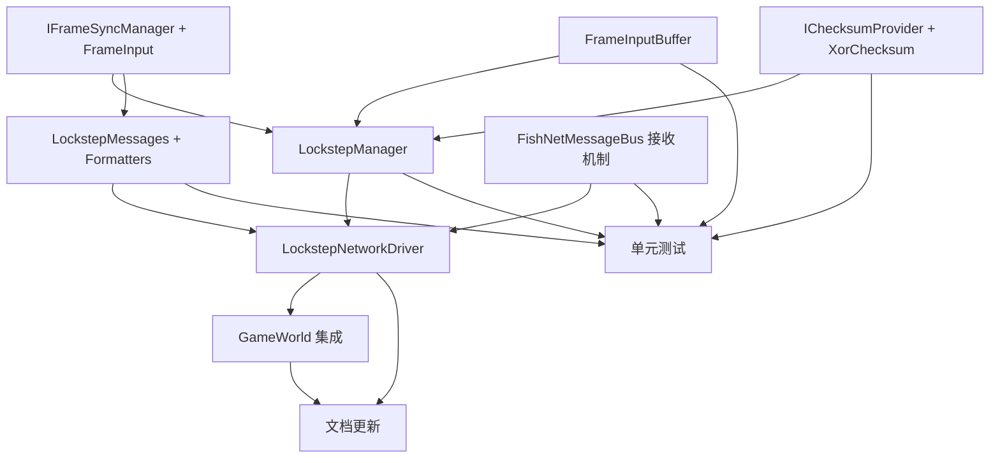

# 计划：C6.1 帧同步机制

## 概述

在已完成的状态同步（SyncVar → SyncedModel → IReadOnlyModel）基础上，新增帧同步（Lockstep）机制。帧同步与状态同步并列于 C6.1 网络模块下：Core 层定义 IFrameSyncManager 接口和帧同步核心逻辑（固定帧率驱动、帧输入缓冲、校验和），Unity 层通过 FishNet 的 Broadcast API 实现客户端输入传输和帧数据广播。

本次范围：Core 层接口 + 实现 + FishNetMessageBus 消息接收机制 + Unity 层网络驱动 + GameWorld 集成 + 测试 + 文档。
非本次范围：C6.2 客户端预测、C6.3 实体权限、帧同步与状态同步的运行时模式切换。

## 上下文分析

### 代码库成熟度

纪律型（Disciplined） — 项目遵循严格的三层架构和命名空间规范，接口定义于 Core、实现于 Unity、测试覆盖充分。帧同步需完全遵循现有模式。

### 关键发现

| 发现 | 影响 |
|------|------|
| FixedMathSharp 已以 DLL 形式引入（Core/Vendor），8 种 MemoryPack 格式化器已注册 | 帧同步的确定性计算基础已就绪 |
| HNLogicTime 已有 LogicFrameCount 静态属性，但缺少固定帧率 Tick 驱动 | LockstepManager 需驱动 HNLogicTime |
| FishNetMessageBus 使用 InstanceFinder.ClientManager.Broadcast / IBroadcast 桥接，纯 C# 不继承 MonoBehaviour | LockstepNetworkDriver 采用相同模式 |
| FishNetMessageBus 仅有发送方法，无消息接收机制（SendToServer/SendToClient/SendToAll，无 RegisterHandler） | 需先扩展 FishNetMessageBus，添加 RegisterHandler 才能在客户端接收帧数据 |
| GameWorld.Tick() 现有固定顺序：PoolManager → ProcedureManager → ControllerManager → AssetManager | 帧同步应在 Tick 首位驱动，确保逻辑帧先于其他模块 |
| C6.1 状态同步通过 NetworkEntityView（NetworkBehaviour）工作，帧同步走纯 C# 消息通道 | 两者隔离，不互斥 |
| 现有 MessageBase 使用 uint MessageId，ConnectionMessages 占用 ID 1-3（ClientConnected=1, ClientDisconnected=2, ServerShutdown=3） | 帧同步消息从 100 起分配 |
| 消息格式化器手动注册在 MessageFormatters.RegisterAll() 中 | 新增消息需同步更新注册 |

## 任务分解

### Wave 1（无依赖，可全部并行）— 数据模型、接口、基础设施

| ID | 任务 | 描述 | 委派建议 | 验收标准 |
|----|------|------|----------|----------|
| T1 | IFrameSyncManager 接口 + FrameInput 数据结构 | 在 HN.Framework.Core.Capability.Network 下创建：IFrameSyncManager（继承 ITickable，定义 CurrentFrame/FrameRate/BufferSize/IsEnabled/SubmitInput/TryGetInput/GetChecksum/RegisterChecksum/OnFrameStart 事件）和 FrameInput（[MemoryPackable] partial struct，含 FrameNumber(ulong) + Actions(Dictionary<string,Fixed64>)，提供 AddAction 便捷方法） | Sisyphus-junior | 编译通过，XML 文档完整，FrameInput 可 MemoryPack 序列化往返 |
| T2 | FrameInputBuffer 帧输入环形缓冲 | 在 HN.Framework.Core.Capability.Network 下：固定容量环形缓冲区，构造函数 FrameInputBuffer(int capacity)，Enqueue/TryGet(ulong,out FrameInput) O(1)，TryGetLatest/ClearBefore(ulong)，Count/IsFull/Capacity 属性 | Sisyphus-junior | 编译通过，含边界逻辑覆盖（满/空/查询不存在帧/环形覆盖/清理过期） |
| T3 | IChecksumProvider + XorChecksumProvider | 在 HN.Framework.Core.Capability.Network 下：IChecksumProvider 接口（Compute(byte[])->ulong / Compare(byte[],ulong)->bool）和 XorChecksumProvider 默认实现（按 8 字节分块 XOR 聚合） | Sisyphus-junior | 编译通过，确定性验证（相同输入→相同输出，不同输入→不同输出） |
| T4 | FishNetMessageBus 消息接收机制 | 在 HN.Framework.Unity.Capability.Network/FishNetMessageBus.cs 扩展：新增 RegisterHandler<T>(Action<T>) where T:MessageBase / UnregisterHandler<T>(Action<T>) / Dispose()，内部维护 Dictionary<uint,List<Delegate>> 按 MessageId 路由，构造函数中注册 ClientManager.RegisterBroadcast<NetworkMessageWrapper>，OnReceiveWrapper 反序列化 Payload 并分发 | Sisyphus-junior | 编译通过，收发往返测试（发送→接收→类型匹配） |

### Wave 2（依赖 Wave 1）— Core 核心实现 + 消息协议

| ID | 任务 | 描述 | 委派建议 | 验收标准 |
|----|------|------|----------|----------|
| T5 | LockstepManager 实现 | 在 HN.Framework.Core.Capability.Network 下：实现 IFrameSyncManager，构造函数 LockstepManager(int frameRate=15, int bufferSize=3)，固定帧率驱动（accumulatedTime += worldDeltaTime，while 循环追帧），Tick 中更新 HNLogicTime.Time/DeltaTime/LogicFrameCount，追帧保护 maxCatchUpFrames=BufferSize*3，持有 FrameInputBuffer 和 IChecksumProvider（默认 Xor），OnFrameStart 事件线程安全触发 | Sisyphus-junior | 编译通过，逻辑测试覆盖（固定帧率驱动/追帧上限/校验和注册获取/OnFrameStart 触发） |
| T6 | LockstepMessages 消息协议 + 格式化器注册 | 在 HN.Framework.Core.Capability.Network/Messages/ 下：FrameInputMessage:MessageBase（客户端→服务端，ClientId+FrameInput，MsgId=100）和 FrameDataMessage:MessageBase（服务端→客户端，FrameNumber+Inputs[]+Checksum，MsgId=101），均为 [MemoryPackable] partial class。在 MessageFormatters.RegisterAll() 中新增两个消息的格式化器注册（参照现有 ClientConnectedMessageFormatter 模式） | Sisyphus-junior | 编译通过，消息 MemoryPack 序列化往返，格式化器注册后正确序列化/反序列化 |

### Wave 3（依赖 Wave 2）— Unity 层实现 + GameWorld 集成

| ID | 任务 | 描述 | 委派建议 | 验收标准 |
|----|------|------|----------|----------|
| T7 | LockstepNetworkDriver | 在 HN.Framework.Unity.Capability.Network 下：纯 C# 类，构造函数注入 IFrameSyncManager 和 FishNetMessageBus，Initialize() 注册收发处理器，客户端模式 SubmitFrameInput 通过 SendToServer 发送 FrameInputMessage，服务端模式收到后写入 LockstepManager 并在 OnFrameStart 中 SendToAll 广播 FrameDataMessage（附带服务端校验和），客户端收到后逐条 SubmitInput 写入并比对校验和（不一致输出 Warning），Shutdown() 注销处理器 | Sisyphus-junior | 编译通过 |
| T8 | GameWorld / GameWorldDriver 集成 | GameWorld 新增 IFrameSyncManager? FrameSyncManager 属性，Tick() 首位插入 (FrameSyncManager as ITickable)?.Tick()，GameWorldDriver.Awake() 创建 LockstepManager() → 创建/获取 FishNetMessageBus 实例 → 创建 LockstepNetworkDriver → 赋值 World.FrameSyncManager，不破坏现有测试 | Sisyphus-junior | 编译通过，通过 Unity MCP 运行现有全量 EditMode 测试确认无回归 |

### Wave 4（依赖 Wave 2+3）— 测试与文档

| ID | 任务 | 描述 | 委派建议 | 验收标准 |
|----|------|------|----------|----------|
| T9 | 单元测试 | Core 层测试：FrameInputBufferTests（满/空/查询不存在/清理过期/环形覆盖）、LockstepManagerTests（帧率驱动准确性/追帧上限/校验和注册获取/OnFrameStart 触发）、LockstepChecksumTests（XOR 确定性/差异检测/Compare 语义）、LockstepMessagesTests（FrameInputMessage/FrameDataMessage MemoryPack 往返）。Unity 层 FishNetMessageBusHandlerTests（RegisterHandler/UnregisterHandler/消息分发）可选不阻塞交付 | Sisyphus-junior | Core 层所有测试通过（通过 Unity MCP run_tests 验证），Unity 层测试如 MCP 不可用则允许跳过 |
| T10 | 文档更新 | docs-site~/docs/guide/network.md C6.1 章节新增帧同步子章节（IFrameSyncManager 接口说明、配置参数、代码示例），docs-site~/docs/dev/architecture.md 网络模块状态更新 C6.1 帧同步标记为已完成，架构~/最终架构.md C6.1 帧同步状态更新为已完成并补充实现说明 | Sisyphus-junior | 文档构建通过（docusaurus build 或 docfx build） |

## 依赖图



并行度说明：
- Wave 1：T1/T2/T3/T4 全部互不依赖，可同时并行
- Wave 2：T5 和 T6 可并行（T6 仅依赖 T1 接口，不依赖 T5 实现）
- Wave 3：T7 依赖 T5+T6+T4，T8 依赖 T7 → 必须串行（先 T7 后 T8）
- Wave 4：T9 与 T10 可并行

软件实例互斥：
- Unity MCP 操作同一实例 → T4（修改 FishNetMessageBus.cs）、T7（新建 LockstepNetworkDriver.cs）、T8（修改 GameWorld.cs/GameWorldDriver.cs）必须串行或在不同 Wave 中（本计划中 T4→T7→T8 已按 Wave 串行，满足约束）
- T9 测试运行使用 Unity MCP，与 T7/T8 不同 Wave，无冲突

## 风险与缓解

| 风险 | 可能性 | 影响 | 缓解策略 |
|------|:------:|------|----------|
| Fixed64 在 Dictionary 中 MemoryPack 序列化失败 | 低 | 阻塞 | Fixed64Formatter 已在 FormattersInitializer.RegisterAll() 注册，MemoryPack DictionaryFormatter 自动使用已注册 value 格式化器。T6 中编写序列化往返测试为先 |
| 帧同步 Tick 与 Unity 渲染帧不同步导致抖动 | 中 | 高 | 固定帧率累加器（accumulatedTime）+ 追帧保护上限（BufferSize*3）防止死亡螺旋 |
| LockstepNetworkDriver 全链路未端到端验证 | 中 | 中 | Core 层逻辑测试覆盖充分；Unity 层网络传输依赖 FishNet 运行时，允许仅 Core 层测试通过即交付 |
| GameWorld 集成破坏现有测试 | 低 | 中 | T8 完成后通过 Unity MCP 运行全量 EditMode 测试确认无回归 |
| T4 FishNetMessageBus 扩展与现有发送方法冲突 | 低 | 低 | 新增 RegisterHandler 使用独立委托注册表，不影响已有 SendToServer/SendToClient/SendToAll 逻辑 |

## 附录 A：配置默认值

| 参数 | 默认值 | 说明 |
|------|:------:|------|
| FrameRate | 15 | 逻辑帧率（tick/s），LockstepManager 构造函数参数，运行时可通过 IFrameSyncManager.FrameRate 修改 |
| BufferSize | 3 | 帧输入缓冲容量，决定客户端可提前发送的帧数 |
| MaxCatchUpFrames | 9 | 追帧上限（BufferSize*3），防止客户端严重落后时无限追帧 |
| MessageId 起始 | 100 | 帧同步消息 ID（100=FrameInputMessage, 101=FrameDataMessage），避免与 ConnectionMessages（1-3）冲突 |

## 附录 B：关键接口预览

### IFrameSyncManager

```csharp
public interface IFrameSyncManager : ITickable
{
    ulong CurrentFrame { get; }
    int FrameRate { get; set; }       // 默认 15
    int BufferSize { get; set; }      // 默认 3
    bool IsEnabled { get; set; }
    
    void SubmitInput(int clientId, FrameInput input);
    bool TryGetInput(ulong frameNumber, out FrameInput input);
    ulong GetChecksum(ulong frameNumber);
    void RegisterChecksum(ulong frameNumber, ulong checksum);
    
    event Action<ulong> OnFrameStart;
}
```

### FrameInput

```csharp
[MemoryPackable]
public partial struct FrameInput
{
    [MemoryPackOrder(0)] public ulong FrameNumber;
    [MemoryPackOrder(1)] public Dictionary<string, Fixed64> Actions;
    
    public FrameInput(ulong frameNumber) { ... }
    public void AddAction(string name, Fixed64 value) { ... }
}
```

### FishNetMessageBus 扩展（新增部分）

```csharp
public class FishNetMessageBus : IDisposable
{
    // ... 现有 SendToServer / SendToClient / SendToAll ...
    
    // 新增：
    public void RegisterHandler<T>(Action<T> handler) where T : MessageBase;
    public void UnregisterHandler<T>(Action<T> handler) where T : MessageBase;
    public void Dispose(); // 取消 ClientManager.RegisterBroadcast
}
```
