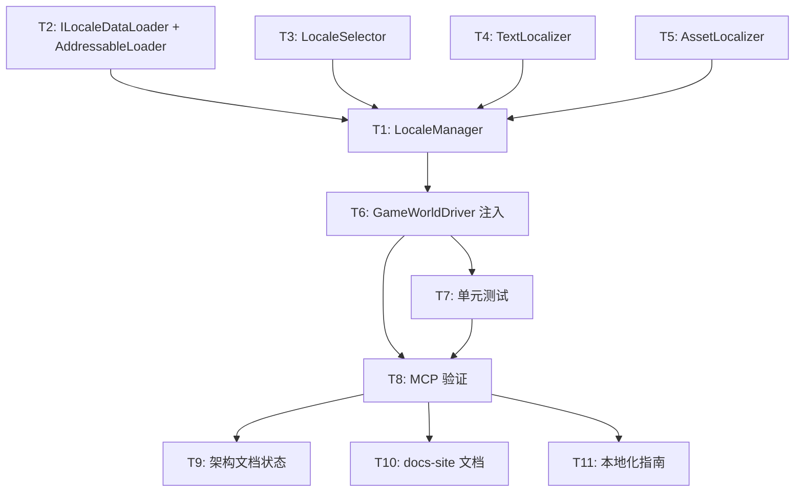

# 计划：C3 本地化系统 — Unity 层实现

## 概述

**目标**：将 C3 本地化系统的 Core 层接口（`Locale`、`StringTable`、`ILocaleProvider`）在 Unity 层落地实现，提供可挂载的 `TextLocalizer` MonoBehaviour、按语言加载资产的 `AssetLocalizer`、以及 Persist 语言偏好的 `LocaleSelector`。完成后端到端可用的本地化工作流。

**非目标**：
- ❌ 不修改 Core 层代码（Core 层 `Locale`/`StringTable`/`ILocaleProvider` 已完善）
- ❌ 不实现 E4 `LocalizationEditorWindow`（Editor 工具属于后续迭代）
- ❌ 不引入第三方本地化库（如 Unity.Localization）

---

## 上下文分析

### 代码库成熟度

**纪律型（Disciplined）** — 框架具有严格的模块化分层、统一的命名空间规范、完整的 XML 文档注释、以及测试要求。所有 Unity 模块实现遵循相同范式。

### 关键发现

| 发现 | 详情 |
|------|------|
| **Core 层已完成** | `Locale`（值类型, BCP 47）、`StringTable`（字典查询, 优雅降级）、`ILocaleProvider`（接口: GetString/SetLocale/OnLocaleChanged） |
| **GameWorld 已就绪** | `GameWorld.LocaleProvider` 属性已定义（第 64 行），`GameWorldDriver.Awake()` 注释表明 "由项目代码通过 World.LocaleProvider 注入" |
| **参考实现模式** | `CameraManager`（纯 C# 类 + IDisposable, 非 MonoBehaviour）、`InputManager`（纯 C# 类 + IDisposable）— 通过 `GameWorldDriver.Awake()` 构造注入 |
| **TMP 依赖已就绪** | `HN.Framework.Unity.asmdef` 已引用 `Unity.TextMeshPro` |
| **无已有测试** | `Tests/HN.Framework.Unity.Tests/` 下无 Localization 测试目录 |
| **Addressables 可用** | asmdef 已引用 `Unity.Addressables`，AssetLocalizer 可使用 Addressables 加载 |

### 设计决策

1. **LocaleManager 定位**：参照 `CameraManager` / `InputManager` 模式 — **纯 C# 类**，实现 `ILocaleProvider` + `IDisposable`，由 `GameWorldDriver.Awake()` 构造并注入 `GameWorld.LocaleProvider`。非 MonoBehaviour（不需要挂载到场景）。

2. **StringTable 加载策略**：`LocaleManager` 内部维护 `Dictionary<Locale, StringTable>` 映射。加载方式采用**可注入的 `ILocaleDataLoader` 接口**，默认提供 `AddressableStringTableLoader` 实现（通过 Addressables 加载 JSON/二进制字符串表），支持自定义（如 Resources、AssetDatabase、网络下载）。

3. **TextLocalizer**：MonoBehaviour 组件，在 `Awake()` 时查找 `GameWorldDriver` → `GameWorld.LocaleProvider`，订阅 `OnLocaleChanged` 事件。核心行为：当语言切换时，从 `ILocaleProvider.GetString(key)` 获取本地化文本并更新 `TMP_Text.text`。

4. **LocaleSelector**：辅助结构，维护 `IReadOnlyList<Locale>` 可用语言列表，提供 `SelectLocale()` / `GetSavedLocale()` / `SaveLocale()`（PlayerPrefs 持久化）。作为 `LocaleManager` 的内部组件。

---

## 任务分解

### Wave 1（无依赖，可并行）

| ID | 任务 | 描述 | 委派建议 | 验收标准 |
|:--:|------|------|----------|----------|
| T1 | 创建 `LocaleManager` | 实现 `ILocaleProvider`：维护 `Dictionary<Locale, StringTable>`，支持动态加载/卸载 StringTable，切换 Locale 触发 `OnLocaleChanged` 事件。实现 `IDisposable`。 | Sisyphus-Junior | 编译通过 + XML 文档完整 |
| T2 | 创建 `ILocaleDataLoader` 接口 + `AddressableStringTableLoader` | 数据加载接口（`LoadTable(Locale)` 返回 `StringTable`），默认实现通过 Addressables LoadAssetAsync 加载 `TextAsset`（JSON 格式），解析为 `StringTable`。 | Sisyphus-Junior | 编译通过 + XML 文档完整 |
| T3 | 创建 `LocaleSelector` 辅助结构 | 维护可用语言列表，提供 `SelectLocale(Locale)` / `GetSavedLocale(Locale fallback)` / `SaveLocale(Locale)` 方法，使用 `PlayerPrefs` 持久化语言偏好 Code。 | Sisyphus-Junior | 编译通过 + XML 文档完整 |
| T4 | 创建 `TextLocalizer` MonoBehaviour | 挂载到有 `TMP_Text` 的 GameObject。自动发现 `LocaleProvider`，订阅 `OnLocaleChanged`，调用 `GetString(key)` 更新文本。支持 `[SerializeField] string _key` 指定本地化键。 | Sisyphus-Junior | 编译通过 + XML 文档完整 |
| T5 | 创建 `AssetLocalizer` 工具类 | 静态辅助方法：`LoadAsset<T>(Locale locale, string assetKey)` 按语言加载资产（通过 Addressables label 或分组命名规则）。提供 `GetLocalizedAssetPath(basePath, locale)` 路径拼接。 | Sisyphus-Junior | 编译通过 + XML 文档完整 |

### Wave 2（依赖 Wave 1 完成+编译）

| ID | 任务 | 描述 | 委派建议 | 验收标准 |
|:--:|------|------|----------|----------|
| T6 | 更新 `GameWorldDriver.Awake()` 注入 LocaleManager | 在 `GameWorldDriver.Awake()` 中添加 `LocaleManager` 构造（默认使用 `AddressableStringTableLoader`），注入 `World.LocaleProvider`，在 `OnDestroy()` 中 Dispose。 | Sisyphus-Junior | 编译通过 + 框架启动不报错 |
| T7 | 编写 Unity 层单元测试 | 在 `Tests/HN.Framework.Unity.Tests/Capability/Localization/` 下创建测试文件：`LocaleManagerTests`（切换语言/事件触发/优雅降级）、`TextLocalizerTests`（键更新/组件销毁后取消订阅）、`LocaleSelectorTests`（持久化/回退）。遵循项目测试规范（`[TestFixture]` + `[SetUp]` / `[TearDown]` + `HideAndDontSave`）。 | Sisyphus-Junior | 全部 EditMode 测试通过 |
| T8 | 通过 Unity MCP 验证编译和测试 | 在 Unity Editor 中：1) 刷新编译 2) 运行 `HN.Framework.Unity.Tests` EditMode 测试 3) 确认无 Console 错误 | Sisyphus-Junior | 编译成功 + 测试全绿 |

### Wave 3（依赖 Wave 2 完成）

| ID | 任务 | 描述 | 委派建议 | 验收标准 |
|:--:|------|------|----------|----------|
| T9 | 更新架构文档状态 | 将 `架构~/开发优先级.md`、`架构~/04-通用能力层（上）.md`、`架构~/最终架构.md` 中 C3 状态从 "📋 Unity 层待实现" 更新为 "✅ 已完成"。 | Sisyphus-Junior | 文档一致性 |
| T10 | 更新 docs-site 文档 | 更新 `docs-site~/docs/api/index.md` 添加 Localization Unity 层 API 条目；更新 `docs-site~/docs/guide/capability.md` 添加 `ILocaleProvider` 服务接口说明；更新 `docs-site~/docs/dev/architecture.md` 中 C3 状态为 ✅。 | Sisyphus-Junior | 文档一致性 |
| T11 | 更新 `docs-site~/docs/guide/` 新增本地化指南 | 创建 `docs-site~/docs/guide/localization.md`，包含：快速开始、TextLocalizer 使用、AssetLocalizer 使用、自定义 ILocaleDataLoader、语言切换流程。更新 `docs-site~/docs/guide/index.md` 导航列表。 | Sisyphus-Junior | 文档完整可用 |

---

## 依赖图



**并行度说明**：
- **Wave 1**：T1-T5 可完全并行（但 T1 的接口设计需先确定，T2-T5 依赖 T1 的输出接口）
  - 实际建议：T1 + T2 先串行（设计接口），T3/T4/T5 可与 T1 后半段并行
- **Wave 2**：T6 必须在 T1 完成后执行；T7/T8 必须在 T6 完成后执行
- **Wave 3**：T9/T10/T11 完全并行

**软件实例互斥**：T8 需要通过 Unity MCP 操作 Unity Editor，与其他 MCP 操作互斥，应串行执行。

---

## 文件清单

### 新增文件（Unity 层）

```
Runtime/HN.Framework.Unity/Capability/Localization/
├── LocaleManager.cs              # ILocaleProvider 实现
├── ILocaleDataLoader.cs           # 数据加载接口
├── AddressableStringTableLoader.cs # Addressables 加载器
├── LocaleSelector.cs             # 语言选择 + PlayerPrefs 持久化
├── TextLocalizer.cs              # TMP 文本更新组件
└── AssetLocalizer.cs             # 按语言加载资产工具类
```

### 新增文件（测试）

```
Tests/HN.Framework.Unity.Tests/Capability/Localization/
├── LocaleManagerTests.cs
├── TextLocalizerTests.cs
├── LocaleSelectorTests.cs
├── AssetLocalizerTests.cs
└── HN.Framework.Unity.Tests.Localization.asmdef（如独立 asmdef）
    → 或复用已有的 HN.Framework.Unity.Tests.asmdef
```

### 修改文件

| 文件 | 修改内容 |
|------|----------|
| `Runtime/HN.Framework.Unity/Driver/Platform/GameWorldDriver.cs` | 添加 LocaleManager 构造与注入、OnDestroy Dispose |
| `架构~/开发优先级.md` | C3 Unity 层状态 📋 → ✅ |
| `架构~/04-通用能力层（上）.md` | C3 Unity 层状态 📋 → ✅ |
| `架构~/最终架构.md` | 模块状态更新摘要 + C3 行状态 |
| `docs-site~/docs/api/index.md` | 新增 Localization 条目 |
| `docs-site~/docs/guide/capability.md` | 新增 ILocaleProvider 服务说明 |
| `docs-site~/docs/dev/architecture.md` | C3 状态 📋 → ✅ |
| `docs-site~/docs/guide/index.md` | 导航新增本地化指南链接 |

### 新增文档

| 文件 | 内容 |
|------|------|
| `docs-site~/docs/guide/localization.md` | C3 本地化系统完整使用指南 |

---

## 风险与缓解

| 风险 | 可能性 | 影响 | 缓解策略 |
|------|:------:|:----:|----------|
| TMP_Text 不与 ILocaleProvider 在同一程序集 | 低 | 中 | 已确认 asmdef 引用 `Unity.TextMeshPro`，TMP 可用 |
| Addressables 异步加载在测试中难以模拟 | 中 | 低 | `ILocaleDataLoader` 接口可注入 mock，测试使用内存实现 |
| GameWorldDriver 注入后需要 ILocaleDataLoader 实现 | 低 | 低 | 默认构造使用 `AddressableStringTableLoader`，用户可按需替换 |
| 线程安全（OnLocaleChanged 事件可能跨线程） | 低 | 低 | 参照 EventBus 模式，Locale 切换在 Unity 主线程执行 |

---

## 关键决策点（需用户确认）

1. **StringTable 数据格式**：JSON（每行 `"key": "value"` 扁平字典）是否可接受？还是需要支持嵌套/变量替换（如 `"Hello {name}"`）？
   - 建议：Phase 1 先支持扁平 JSON + 基础字符串插值（`string.Format`），后续扩展。

2. **LocaleManager 默认 Locale**：默认回退到 `Locale.zhCN` 还是 `Locale.enUS`？
   - 建议：中文项目默认 `zhCN`，可通过 `LocaleSelector.GetSavedLocale(zhCN)` 覆盖。

3. **AssetLocalizer 的资产分组规则**：按 Addressables Label（如 `locale_zh-CN`）还是按路径前缀（如 `Assets/Localization/zh-CN/`）？
   - 建议：Phase 1 使用路径拼接模式 `{basePath}/{locale.Code}/{assetName}`，简单直观。

4. **是否本次同时实现 E4 LocalizationEditorWindow？**
   - 建议：本次仅实现 Unity 运行时层，E4 Editor 工具留待后续迭代（工作量独立，不阻塞运行时使用）。

---

> ⚠️ **此计划尚未经 Momus 审核。用户批准后将自动触发审核流程。**
