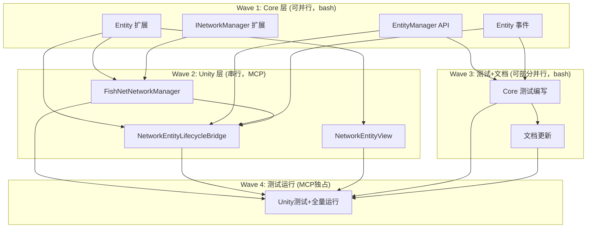

# 计划：C6.3 网络实体权限与生命周期

## 概述

实现 Entity 系统的网络权限与生命周期管理，通过 Core 层 Entity 所有权模型 + Unity 层 FishNet Spawn/Despawn 桥接，
达成 **EntityManager.Spawn → FishNet.Spawn → 全端实例化** 的集成链路。

**目标：**
- Core 层：Entity 新增 `OwnerClientId` 属性，EntityManager 新增网络感知的 Spawn/Despawn/权限查询 API
- Unity 层：新增 `NetworkEntityLifecycleBridge` 桥接组件，增强 `NetworkEntityView` 链接 Core EntityId
- 权限模型：Server 始终拥有最终权威 + Entity 可指定 owner client

**非目标：**
- 不实现 Entity 数据自动同步（已有 C6.1 SyncVar/SyncedModel 机制）
- 不修改 FishNet 底层 Spawn/Despawn 逻辑
- 不实现客户端预测相关（已有 C6.2）

## 上下文分析

### 代码库成熟度
**过渡型（Transitional）** — 网络模块（C6/C6.1/C6.2）测试完备、架构清晰；Entity 系统整洁。但 Entity ↔ Network 之间缺少桥接层。

### 关键发现

| 发现 | 详情 |
|------|------|
| **Entity 无所有权概念** | Entity 只有 EntityId/EntityDefId，缺少 OwnerClientId |
| **EntityManager 无网络感知** | Spawn/Despawn 仅管理 Core 层数据，与 FishNet Spawn 无关联 |
| **EventBus 桥接无人消费** | EntitySpawnedEvent/EntityDespawnedEvent 已在 Core 层发布，但 Unity 层无任何订阅者 |
| **NetworkEntityView 未关联 Entity** | NetworkEntityView 有 NetId（FishNet ObjectId），没有 Core 层 EntityId |
| **FishNetConnectionAdapter 已有 LocalClientId** | 连接适配器已可查询本地客户端 ID |
| **FishNet API 就绪** | ServerManager.Spawn(nob, ownerConnection) / Despawn(nob) / NetworkObject.GiveOwnership 均可直接使用 |

### 架构设计

```
┌──────────────────────────────────────────────────────┐
│ Core 层                                               │
│                                                       │
│ Entity + OwnerClientId  ←── 所有权数据                 │
│ EntityManager.SpawnWithOwner(defId, ownerId)          │
│   ├── 创建 Entity，设置 OwnerClientId                   │
│   ├── 发布 EntitySpawnedEvent                         │
│   └── HasAuthority / TransferOwnership               │
│                                                       │
│ INetworkManager.LocalClientId  ←── 权限判定所需         │
└──────────────────────┬───────────────────────────────┘
                       │ EventBus 桥接
┌──────────────────────┴───────────────────────────────┐
│ Unity 层（仅服务端）                                   │
│                                                       │
│ NetworkEntityLifecycleBridge                          │
│   ├── 订阅 EntitySpawnedEvent                         │
│   │   → 实例化预制体 → 设置 EntityId                   │
│   │   → FishNet.ServerManager.Spawn(nob, ownerConn)   │
│   ├── 订阅 EntityDespawnedEvent                       │
│   │   → FishNet.ServerManager.Despawn(nob)            │
│   └── 订阅 EntityOwnershipTransferredEvent             │
│       → NetworkObject.GiveOwnership(newOwnerConn)     │
│                                                       │
│ NetworkEntityView（服务端 & 客户端）                    │
│   ├── SyncVar<uint> EntityId  ←── 与 Core Entity 关联  │
│   ├── IsOwnedByMe  ←── FishNet IsOwner 封装            │
│   └── OnSpawned/OnDespawned 生命周期                   │
└──────────────────────────────────────────────────────┘
```

**数据流（服务端 Spawn）：**
```
EntityManager.SpawnWithOwner(defId=1001, ownerId=3)
  → Entity { Id=42, DefId=1001, OwnerClientId=3 }
  → Publish EntitySpawnedEvent(42, 1001)
  → NetworkEntityLifecycleBridge 接收
  → 实例化 prefab → NetworkEntityView.SetEntityId(42)
  → FishNet.Spawn(nob, ownerConn[clientId=3])
  → FishNet 在所有客户端创建 NetworkObject 实例
  → 各客户端 NetworkEntityView.OnSpawned() 触发
  → 客户端可从 SyncVar 读取 EntityId=42
```

**权限判断：**
```
// Core 层（服务端）
entityManager.HasAuthority(entityId=42, clientId=3) → true（owner）
entityManager.HasAuthority(entityId=42, clientId=5) → false（非 owner）
entityManager.HasAuthority(entityId=42, clientId=0) → true（server 永远有权限）

// Unity 层（客户端）
networkEntityView.IsOwnedByMe → FishNet NetworkBehaviour.IsOwner
```

## 任务分解

### Wave 1（Core 层，无 MCP 依赖，全部可并行）

> **MCP 状态**：不需要。Core 层纯 C# 文件通过 bash 直接编辑。

| ID | 任务 | 描述 | 操作方式 | 委派建议 | 验收标准 |
|----|------|------|:------:|----------|----------|
| T1 | **Entity 数据模型扩展** | 修改 `Runtime/HN.Framework.Core/Level/Logic/Entity/Entity.cs`：<br>· 新增 `[MemoryPackOrder(2)] int OwnerClientId`（-1 无 owner，0=server，>0=client）<br>· 新增 `bool IsOwned => OwnerClientId >= 0` 属性<br>· 更新 `Clear()` 重置 `OwnerClientId = -1`<br>· 更新 `Initialize()` 新增 `ownerClientId` 参数（默认 -1） | bash 编辑 | Sisyphus-Junior | Entity.OwnerClientId 可读写（internal set），IsOwned 正确反映，Clear 重置 |
| T2 | **EntityManager 网络 API** | 修改 `Runtime/HN.Framework.Core/Level/Logic/Entity/EntityManager.cs`：<br>· 新增 `SpawnWithOwner(int entityDefId, int ownerClientId)` 方法<br>· 修改 `Spawn(int)` 内部调用 `SpawnWithOwner(defId, -1)` 保持向后兼容<br>· 新增 `HasAuthority(uint entityId, int clientId)` — server(0) 永远 true<br>· 新增 `TransferOwnership(uint entityId, int newOwnerId)`<br>· 新增 `RemoveOwnership(uint entityId)`<br>· 新增 `GetOwnedEntities(int clientId)` 查询 | bash 编辑 | Sisyphus-Junior | API 编译通过，Server(0) 对所有实体 HasAuthority=true，所有权转移正确 |
| T3 | **Entity 权限事件** | 修改 `Runtime/HN.Framework.Core/Level/Logic/Entity/EntityEvents.cs`：<br>· 新增 `EntityOwnershipTransferredEvent` 只读结构体（EntityId + OldOwnerId + NewOwnerId）<br>· 在 EntityManager.TransferOwnership 中发布此事件 | bash 编辑 | Sisyphus-Junior | 事件结构体字段正确，TransferOwnership 时正确发布 |
| T4 | **INetworkManager 接口扩展** | 修改 `Runtime/HN.Framework.Core/Capability/Network/INetworkManager.cs`：<br>· 新增 `int LocalClientId { get; }` 属性<br>· 新增 `IReadOnlyList<int> ConnectedClientIds { get; }` 属性 | bash 编辑 | Sisyphus-Junior | 接口编译通过，属性签名正确 |

### Wave 2（Unity 层，⚠️ 必须串行 — 共享同一 Unity MCP 实例）

> **MCP 互斥约束**：T5/T7/T6 全部通过 Unity MCP 操作脚本文件（修改或新建），同一 Unity 实例同一时间只允许一个任务操作。
> 
> **执行顺序**：T5 → T7 → T6（T6 依赖 T5 的 API，故 T5 先执行；T7 独立于 T5 可任意排；T6 排在最后因为它是最复杂的桥接组件）

| ID | 任务 | 描述 | 操作方式 | 委派建议 | 验收标准 |
|----|------|------|:------:|----------|----------|
| T5 | **FishNetNetworkManager 扩展** | 修改 `Runtime/HN.Framework.Unity/Capability/Network/FishNetNetworkManager.cs`：<br>· 实现 `LocalClientId`（从 FishNet ClientManager.Connection.ClientId 获取，未连接返回 -1）<br>· 实现 `ConnectedClientIds`（从 ServerManager.Clients 获取）<br>· 新增 `GetConnection(int clientId)` 辅助方法（通过 InstanceFinder 查找 NetworkConnection） | MCP `apply_text_edits` | Sisyphus-Junior | LocalClientId 正确反映连接状态，GetConnection 返回正确的 NetworkConnection |
| T7 | **NetworkEntityView 增强** | 修改 `Runtime/HN.Framework.Unity/Capability/Network/NetworkEntityView.cs`：<br>· 新增 `[SerializeField] SyncVar<uint> m_syncedEntityId`<br>· 新增 `uint SyncedEntityId` 属性（public）<br>· 新增 `internal void SetEntityId(uint id)` — 服务端 spawn 前设置<br>· 新增 `bool IsOwnedByMe` 属性（封装 FishNet `IsOwner`）<br>· 新增 `bool IsOwnedByServer` 属性<br>· 重写 `OnSpawned()` 从 SyncVar 读取 EntityId<br>· 重写 `OnDespawned()` 清理注册表 | MCP `apply_text_edits` | Sisyphus-Junior | SyncedEntityId 在客户端正确同步，IsOwnedByMe 正确反映所有权 |
| T6 | **NetworkEntityLifecycleBridge 创建** | **新建** `Runtime/HN.Framework.Unity/Capability/Network/NetworkEntityLifecycleBridge.cs`：<br>· MonoBehaviour 组件，服务端专用<br>· `Dictionary<int, GameObject>` prefab 注册表（entityDefId → prefab）<br>· 订阅 EntitySpawnedEvent → 实例化 + FishNet.Spawn<br>· 订阅 EntityDespawnedEvent → FishNet.Despawn<br>· 订阅 EntityOwnershipTransferredEvent → GiveOwnership<br>· 维护 `NetworkEntityView` 注册表（ObjectId → view）用于 Despawn 查找<br>· 依赖注入：通过 `Initialize(GameWorld, FishNetNetworkManager)` 方法 | MCP `create_script` | Sisyphus-Junior | Server 端 Spawn → 全端可见，Despawn → 全端销毁，所有权转移正确 |

### Wave 3（测试编写 + 文档，可部分并行）

> **MCP 状态**：T8 测试文件编写（Core 层纯 .cs 文件）不需要 MCP；T10 文档不需要 MCP；T8 和 T10 可并行。
> 
> **T9 为 MCP 独占 Wave**：创建 Unity 测试文件需 `create_script`，运行测试需 `run_tests`，同属一个 Unity 实例。

| ID | 任务 | 描述 | 操作方式 | 委派建议 | 验收标准 |
|----|------|------|:------:|----------|----------|
| T8 | **Core 层测试编写** | **修改/新增** `Tests/HN.Framework.Core.Tests/` 下的测试文件：<br>· EntityTests.cs：新增 OwnerClientId 默认值、IsOwned、Clear 重置测试<br>· EntityManagerTests.cs：新增 SpawnWithOwner、HasAuthority、TransferOwnership、RemoveOwnership、GetOwnedEntities、事件发布测试<br>· INetworkManagerContractTests.cs：新增 LocalClientId、ConnectedClientIds 测试 | bash 编辑 | Sisyphus-Junior | 测试逻辑覆盖所有权所有场景 |
| T10 | **文档更新** | 更新以下文档：<br>· `docs-site~/docs/guide/network.md` — 新增 C6.3 章节<br>· `docs-site~/docs/guide/entity.md` — 新增网络权限与生命周期章节<br>· `docs-site~/docs/api/index.md` — 新增 API 条目<br>· `docs-site~/docs/dev/architecture.md` — 更新 C6.3 状态为 ✅<br>· `架构~/开发优先级.md` — 更新 C6.3 状态<br>· `架构~/04-通用能力层（上）.md` — 更新 C6.3 状态 | bash 编辑 | Sisyphus-Junior | 所有文档更新准确，状态标记一致 |

### Wave 4（Unity 测试编写 + 全量测试运行，⚠️ MCP 独占）

> **MCP 互斥约束**：T9 需要 MCP 创建 Unity 测试文件 + 运行 EditMode 测试。整个 Wave 4 独占 Unity MCP 实例。

| ID | 任务 | 描述 | 操作方式 | 委派建议 | 验收标准 |
|----|------|------|:------:|----------|----------|
| T9 | **Unity 测试编写 + 测试运行** | 分为两步：<br>**步骤 A — 创建测试文件**：<br>· 新建 `Tests/HN.Framework.Unity.Tests/Capability/Network/NetworkEntityLifecycleBridgeTests.cs`<br>· 扩展 `Tests/HN.Framework.Unity.Tests/Capability/Network/NetworkEntityViewTests.cs`（SyncedEntityId 同步、IsOwnedByMe）<br>**步骤 B — 运行全量测试**：<br>· `refresh_unity` 触发编译<br>· `run_tests` EditMode 运行项目级测试<br>· 未通过 → 排查修复 → 重新运行直到全绿 | MCP `create_script` + `run_tests` | Sisyphus-Junior | 所有新增及已有测试全绿通过 |

## 依赖图



**串行执行说明：**
- Wave 1 → Wave 2：数据依赖（Unity 层需要 Core 层 API 定义）
- Wave 2 内部 T5 → T7 → T6：MCP 互斥串行
- Wave 2 → Wave 3：T8 和 T10 仅需 Wave 1 完成（不依赖 Wave 2），实际上可与 Wave 2 并行编排
- Wave 3 → Wave 4：MCP 互斥（T9 需要 Unity 实例，与 Wave 2 冲突）

## 风险与缓解

| 风险 | 可能性 | 影响 | 缓解策略 |
|------|:------:|:----:|----------|
| FishNet SyncVar\<uint\> 在 `abstract` NetworkEntityView 中行为异常 | 低 | 中 | FishNet v4 支持抽象 NetworkBehaviour 上的 SyncVar；若异常则改为具体子类中声明 |
| NetworkEntityLifecycleBridge 与 ViewFactory 职责重叠 | 中 | 低 | Bridge 负责网络 Spawn，ViewFactory 负责本地 View，通过不同事件区分 |
| Entity 类 MemoryPack 序列化格式变更导致不兼容 | 低 | 高 | OwnerClientId 仅新增字段（MemoryPackOrder(2)），不改变已有字段格式 |
| 客户端预测（C6.2）与 C6.3 权限模型冲突 | 低 | 中 | PredictedNetworkEntityView 已独立处理预测逻辑，C6.3 所有权模型运行在更高抽象层 |

---

## 关键决策点（已确认）

1. ✅ **Entity.OwnerClientId 默认值**：`-1`（无 owner），Server 使用 `0`
2. ✅ **Bridge 与 ViewFactory 分离**：Bridge 负责网络 Spawn，ViewFactory 负责本地 View
3. ✅ **客户端不创建 Entity 本地镜像**：客户端通过 NetworkEntityView 获取实体身份
4. ✅ **INetworkManager.ConnectedClientIds**：包含在设计中
